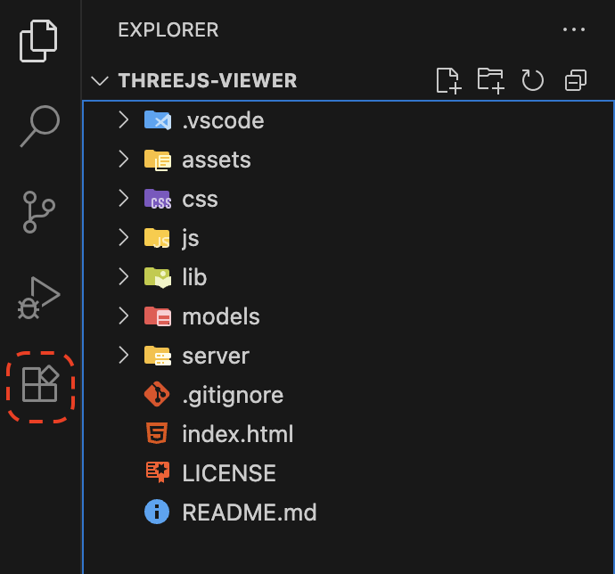
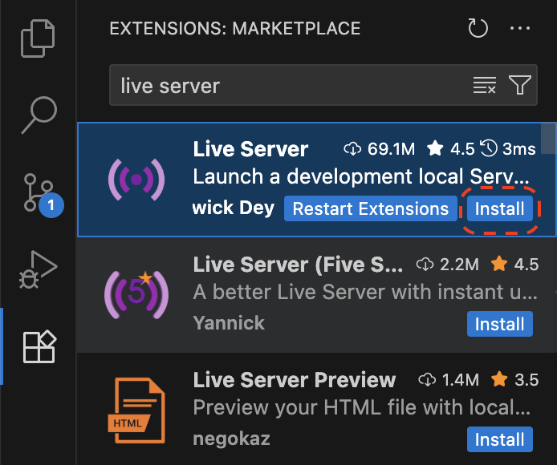
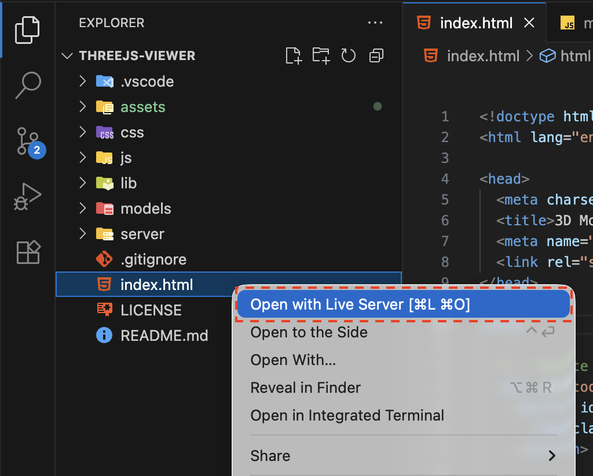
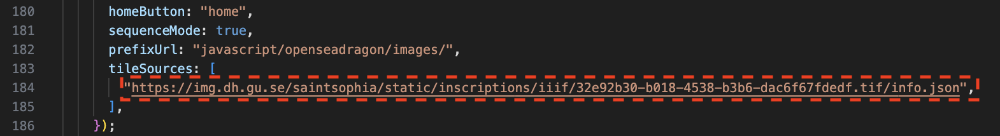
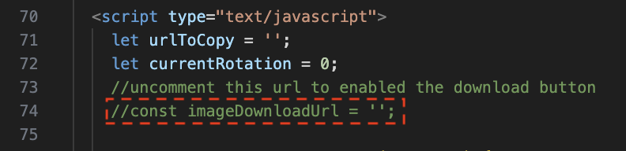

# OpenSeadragon

<!-- [![Gitter][gitter-badge]][gitter]
[![Build Status][build-badge]][build] -->

An open-source, web-based viewer for zoomable images, implemented in pure JavaScript.

See it in action and get started using it at [https://openseadragon.github.io/][openseadragon].

Install Visual Studio Code.

## Getting Started
1. Click the extensions tab on the left toolbar.

2. Search for and then install the [Live Server](https://marketplace.visualstudio.com/items?itemName=ritwickdey.LiveServer) plug-in.

3. Right-click on the `index.html` file and select **Open with Live Server**.

Change the image by adjusting this line in index.html.

Uncomment this line and add the link to your image in order to enable downloads.
